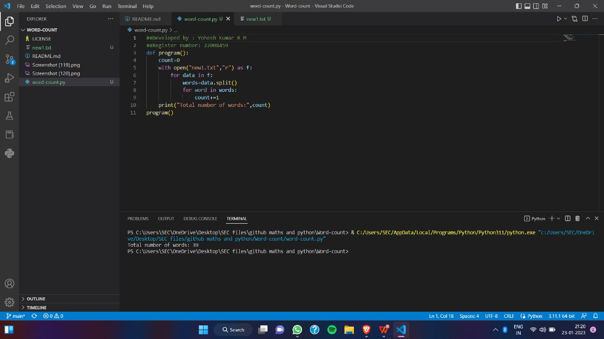
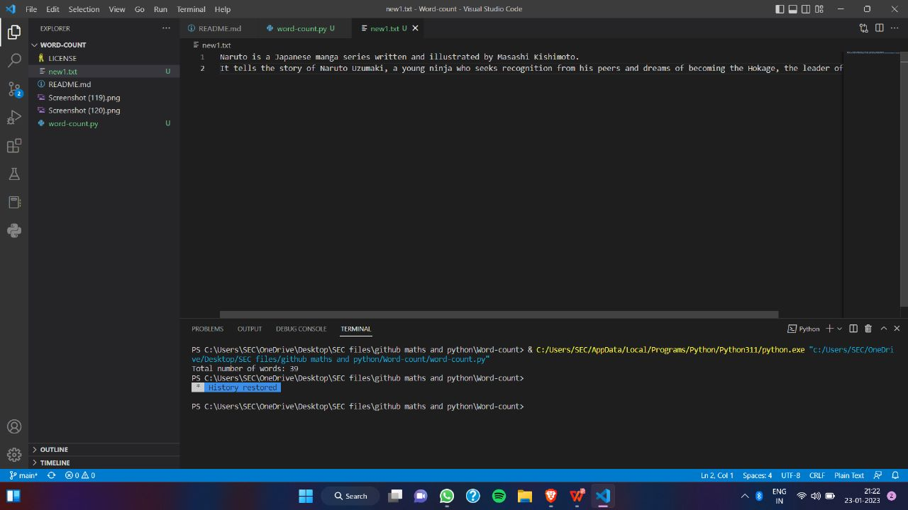

# Word-count
## AIM:
To write a python program for getting the word count from a text.
## EQUIPEMENT'S REQUIRED: 
PC
Anaconda - Python 3.7
## ALGORITHM: 
### Step 1:
Create a file and add some content into it.

### Step 2: 
Open file using with keyword/built-in function in read mode.
 
### Step 3: 
Use read() to read the contents of the file

### Step 4:  
Split the lines using split().

### Step 5: 
Iterate the list and increment the count

### Step 6: 
Print the output.

## PROGRAM:def wordcount():
```
#developed by:yoheshkumar
#register number:22008459
def wordcount():
  count = 0
  with open("MyFile.txt","r") as f2:
    data=f2.read()
    for line in data.split():
      count += 1
  print("The total number of word count is", count)
wordcount()
```

### OUTPUT:



## RESULT:
Thus the program is written to find the word count from a text.
